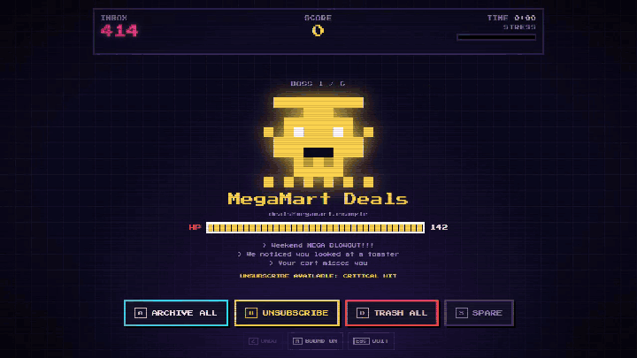

# INBOX RAID

> Every enemy you kill is an email that really leaves your inbox.



An arcade raid on your real inbox. Senders who flood you become **bosses** whose HP is the number of emails they sent. Archive them in one hit, or land a critical: send their unsubscribe and archive them all at once. Then clear the **horde** of single emails with combos before your stress bar fills.

Built for **Hackyard Yard #4: Gamification** (Oct 5 to 9, 2026). The rule of the yard: the real chore has to get done. Here it does. The game *is* the inbox.

**Play the demo: https://josemardp.github.io/inbox-raid/**

| Boss | Keys | Horde | Keys |
|---|---|---|---|
| Archive all | `A` | Archive | `←` |
| Unsubscribe + archive (critical) | `U` | Trash | `↓` |
| Trash all | `D` | Quest (star + archive) | `→` |
| Spare | `S` | Undo | `Z` |

`M` sound, `P` privacy mode, `Esc` quit. On a phone, tap the buttons or swipe the card. When the raid ends, `C` saves a share card with your numbers (no subjects, no names).

## Two ways to play

- **Demo:** a fake (and painfully familiar) inbox. No login, ten seconds to start.
- **Raid my Gmail:** every hit is a real action on your mailbox.
  - The Google app is still in testing, so **real mode only works for invited accounts** for now. Everyone else gets the demo.
  - Google's consent screen asks for `gmail.modify`: read, label and send. It cannot permanently delete anything. *Send* is used for one thing only: unsubscribing from senders that only accept unsubscribe by email. That email always says just "unsubscribe", goes only to an address on the sender's own site, and the address is shown before you press `U`.

## Safety first

- **Nothing is ever permanently deleted.** Archive keeps mail in All Mail; trash keeps it for 30 days.
- **Undo (`Z`) fixes your inbox first**, then the game. If Gmail refuses, the game says so and changes nothing.
- **Quests** are emails that need you: they get a star and leave the inbox, waiting in Starred.
- **No server.** The game talks to Gmail straight from your browser. The access token lives in memory and dies with the tab. Fonts are bundled; Google's sign-in script only loads when you reach for the Gmail button.
- **Gentle on Gmail:** reads are paced to Gmail's per-minute quota, so a big inbox scans slowly instead of failing.
- **Honest numbers:** a raid fights up to 500 scanned emails (60 in the horde). Anything beyond counts as still in your inbox, so "INBOX ZERO" only shows when it is true.
- **Privacy mode (`P`)** blacks out every subject, preview and horde sender (and any boss that looks like a person), so you can record or stream a raid. Only bulk senders keep their name.
- One-click unsubscribe (RFC 8058) is a direct request to the sender, so the sender sees your IP, like when you click their link. A browser cannot read the sender's answer, so the game says "unsubscribe sent", never "gone forever". Undo brings the emails back, but a sent unsubscribe cannot be called back.

## Run it locally

```bash
npm install
npm run dev      # http://localhost:5173/inbox-raid/
npm test         # game rules and Gmail layer, with a fake Gmail
npm run build
```

Stack: Vite + TypeScript, no framework. Sound effects with [ZzFX](https://github.com/KilledByAPixel/ZzFX), music generated with WebAudio, monsters generated from each sender's address, font [Press Start 2P](https://fonts.google.com/specimen/Press+Start+2P) (OFL).

Built solo during the yard week with [Claude Code](https://claude.com/claude-code).

## License
MIT
